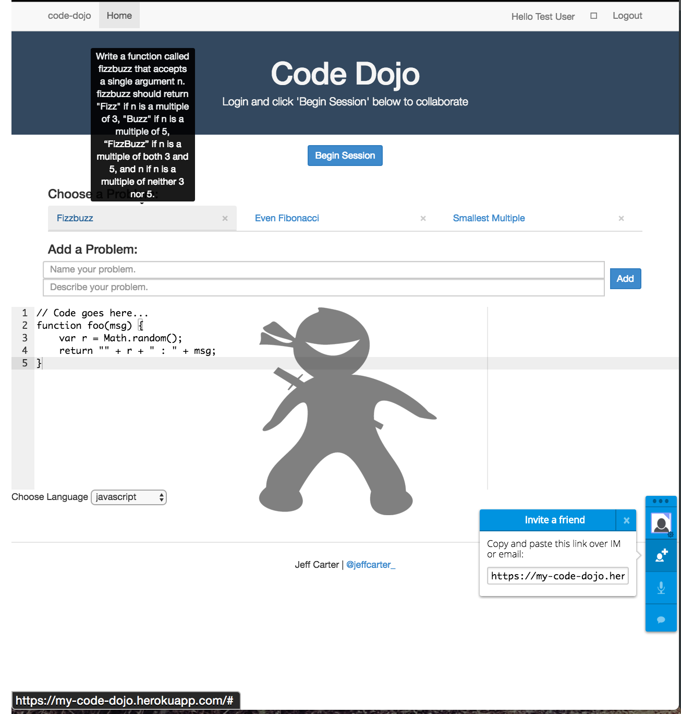

# Code Dojo

A Place to Practice the Art of Code

## Links
* Code Dojo on the web: [https://my-code-dojo.herokuapp.com/](https://my-code-dojo.herokuapp.com/)
* [Trello Board](https://trello.com/b/Tn8xxsPW)

## Notes
### User Stories
1. As a junior developer, I want to be able to pair program with other developers
to accelerate my learning.

2. As a hiring manager for remote developers, I want to be able to give programming
challenges to applicants and collaborate in real-time.

### Wireframes

## Technologies Used
* Languages --> HTML5, CSS3(SASS), Javascript, Node.js
* Libraries --> TogetherJS, Ace
* Framework --> AngularJS, Express, Mongoose
* Database--> MongoDB
* Front-end design & development --> Bootstrap & AngularJS
* Project mockup --> Sketch
* Project Planning/User Stories --> Trello
* Deployment --> Heroku

## Known Bugs
* Lose syntax highlighting in the code editor upon depolyment to Heroku.

## Next Steps
* Persist data to user account
* Add challenges to the database
* Connect HackerRank or other code challenge API for scoring, etc.

## Develop
1) Clone this repo and run npm install && bower install.
2) Then use gulp serve to get it running.
